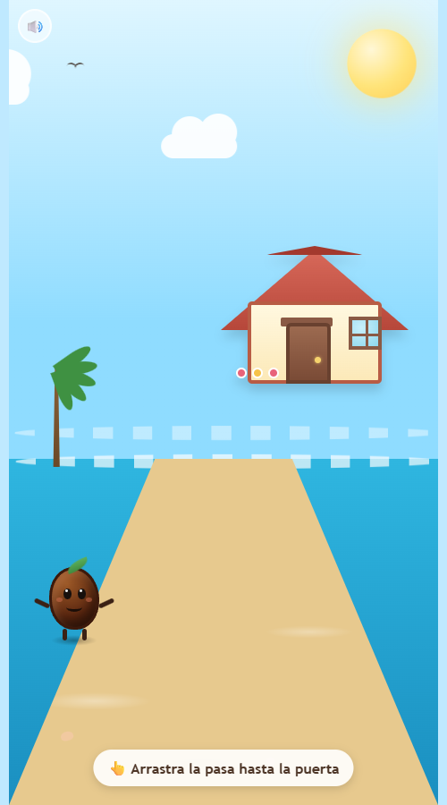

<div align="center">



# 🍇 Pasa Pasa

*Un mini-juego de arrastrar en un solo archivo, sin dependencias y en español*

[](https://github.com/Natanmiuz/olaolapasapasa)

[Características](#características) • [Cómo jugar](#cómo-jugar) • [Ejecutar](#ejecutar) • [Estructura](#estructura) • [Sonido](#sonido) • [Accesibilidad](#accesibilidad) • [Colaborar](#colaborar)

</div>

Una pasa (🍇) llega a la playa buscando refugio y se encuentra con una ola (🌊). Arrastra la pasa hasta la puerta de la casita para desencadenar un corto diálogo y completar el juego. Toda la interfaz está en español.

## Características

- **Arrastrar y soltar** con ratón o táctil, mediante eventos *pointer* unificados.
- **Control por teclado** con las flechas, para jugar sin ratón.
- **Diálogo en 3 pasos** entre la pasa y la ola, con animaciones y confeti al terminar.
- **Efectos de sonido generados** con la Web Audio API: sin archivos de audio ni licencias que gestionar.
- **Escena animada**: sol, pájaros, nubes, palmera, espuma de mar y conchas.
- **Respeto por `prefers-reduced-motion`** para quien prefiera menos animación.

> [!NOTE]
> El juego está pensado para móvil (táctil) y escritorio (ratón y teclado).

## Cómo jugar

1. Abre `pasa_pasa.html` en cualquier navegador.
2. Arrastra la pasa hasta la puerta de la casa — en escritorio también puedes moverla con las flechas del teclado.
3. Pulsa **Siguiente** para avanzar el diálogo con la ola.
4. Al terminar, te esperan confeti y un jingle de victoria. 🎉

## Ejecutar

No hay build, ni instalación, ni servidor:

```bash
# Basta con abrir el archivo directamente en el navegador
open pasa_pasa.html    # macOS
start pasa_pasa.html   # Windows
```

## Estructura

Todo el juego vive en un único archivo autocontenido:

```
pasa_pasa.html   # Markup + CSS + JavaScript en línea
docs/screenshot.png
```

- **CSS** con variables personalizadas en `:root` para los colores del escenario.
- **JavaScript** en una IIFE con `'use strict'`, sin dependencias ni variables globales.
- **Sonido** mediante `tone()` y helpers de SFX (`sfxPickUp`, `sfxArrive`, `sfxClick`, `sfxVictory`) sobre la Web Audio API.

## Sonido

Los efectos se sintetizan en tiempo real con la Web Audio API, por lo que no hay archivos de audio externos. Pulsa el botón **🔊** (arriba a la izquierda) para silenciar o reactivar el sonido.

## Accesibilidad

- Se puede jugar solo con teclado: las flechas mueven la pasa en pasos de 14 px.
- Las animaciones se desactivan cuando el sistema pide `prefers-reduced-motion`.
- El diálogo se anuncia con `aria-live` y los elementos interactivos tienen etiquetas accesibles.

## Colaborar

¿Ideas para mejorar el juego? Las pull requests son bienvenidas.

> [!IMPORTANT]
> Se aceptan mejoras con tal de trollear al pelucas del ADRITY. 😎